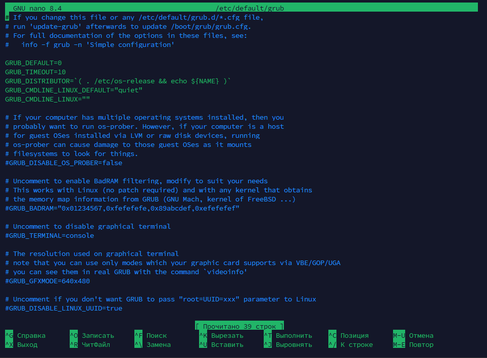
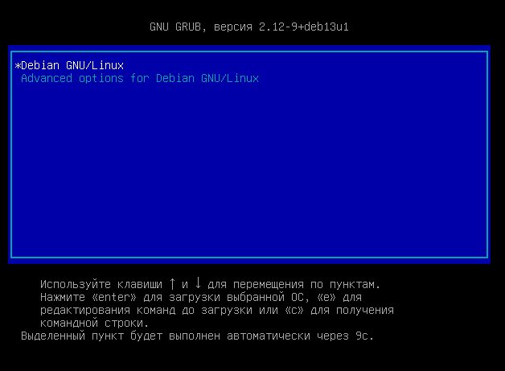

# Настройка загрузчика
### Измените поведение меню GRUB.

1. `sudo nano /etc/default/grub` - это основной конфигурационный файл загрузчика GRUB в Linux системах. 

```
GRUB_TIMEOUT=10 # было 5 - увеличил до 10
GRUB_TIMEOUT_STYLE=menu # чтобы меню показывалось всегда
```
В нём задаются параметры запуска, задержка перед загрузкой, отображение меню, выбор ядра и другие настройки.



Пояснение к параметрам:
- `GRUB_TIMEOUT=10` — время в секундах, которое GRUB будет ждать перед автоматической загрузкой выбранной записи. Здесь значение увеличено с 5 до 10
- `GRUB_TIMEOUT_STYLE=menu` — включение отображения меню выбора операционки вместо скрытого режима. При загрузке можно увидеть список доступных вариантов и выбрать нужный вручную.

2. `sudo update-grub` - команда, которая пересчитывает и обновляет конфигурационный файл GRUB на основе текущих параметров, установленных в `/etc/default/grub`, а также списка доступных операционных систем.

3. Меню GRUB при загрузке.



В меню список доступных операционных систем и версий ядра. Это меню позволяет выбрать основную систему, или дополнительную, если имеется, а также выбрать снимок. Время ожидания 10 секунд даёт возможность выбрать нужный пункт до автоматической загрузки.

### Ответьте на вопрос: что было бы, если бы вы забыли выполнить `update-grub` ?

Если бы команда `sudo update-grub` не была бы выполнена, изменения в `/etc/default/grub` не были бы записаны в итоговый конфиг файл GRUB. В результате система продолжила бы использовать старые параметры загрузки, и изменение в меню не сработали бы. GRUB продолжит загружаться по старой конфигурации.