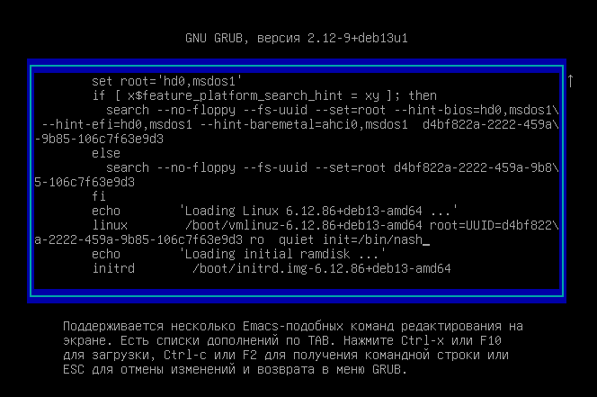
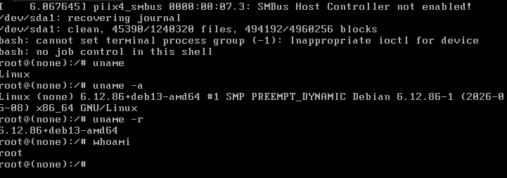
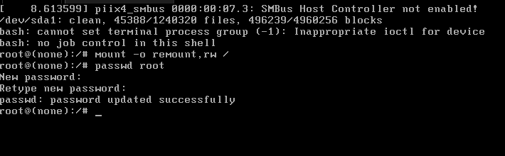
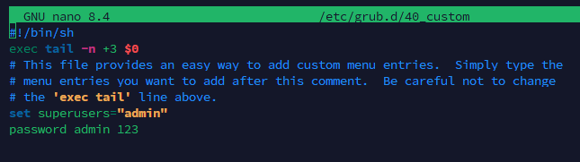

# Задание 6. Атака и защита загрузки
Изучить уязвимость процесса загрузки Linux через GRUB, выполнить сброс пароля root с помощью параметра init=/bin/bash, а затем защитить загрузчик GRUB паролем.
### Часть А. Сброс пароля root
1. **Редактирование параметров GRUB**

В строке, начинающейся с `linux`, в конец был добавлен параметр:
```
init=/bin/bash
```


После этого нажал F10 для загрузки оболочки в качестве процесса init. В результате обычная загрузка системы и аутентификация не выполняются.

2. **Получение оболочки без ввода пароля, перемонтирование корневой файловой системы и смены пароля root**



По умолчанию корневая файловая система была доступна только для чтения. 
Для изменения пароля она была перемонтирована в режиме записи
```
mount -o remount,rw /
```
Расшифровка команды:
- mount - основная утилита Linux для монтирования файловых систем к единому дереву каталогов.

- -o - флаг, передающий утилите параметры монтирования. Всё, что идет сразу за -o идет как список опций.

- remount - указание не монтировать устройство заново с нуля, а изменить параметры уже смонтированной файловой системы.

- rw (read-write) - параметр, разрешающий чтение и запись.

- / - Корневой каталог.

После получения доступа на запись был изменен пароль пользователя root:
```
passwd root
```
Команда смены пароля у пользователя, запрашивает новый пароль и повторно ввести новый пароль для смены.



После смены пароля виртуальную машину перезапустили и проверили новый пароль для root.

#### Какого механизма защиты не хватает

> Атака сработала из-за отсутствия защиты доступа к настройкам загрузчика GRUB. В результате Linux запустил оболочку с высокими привилегиями ещё до запуска обычных механизмов аутентификации. Пароль пользователя root сам по себе не защищает систему от такого способа получения доступа.

### Часть Б. Защита GRUB

1. **Создание пароля GRUB**

Для защиты от возможности редактирования параметров загрузки, необходимо установить пароль на редактирование меню GRUB.

Редактирование файла пользовательских конфигурация загрузчика GRUB:
```
nano /etc/grub.d/40_custom
```
> `40_custom` — специальный файл, предназначенный исключительно для ваших собственных записей.



В конец файла были добавлены строки:
```
set superusers="admin"
password admin 123
```
- `set superusers="admin"` — создает учетную запись суперпользователя GRUB с именем admin. Пользователь с этим именем получает полный доступ к редактированию пунктов меню GRUB и вызову командной строки GRUB при загрузке компьютера.
- `password admin 123` — задаёт открытый пароль 123 для пользователя admin.

Использование директивы password хранит пароль в виде открытого текста. Это небезопасно, т.к. любой, у кого есть доступ к чтению файла конфигурации, увидит пароль.

После изменения конфигурации необходимо выполнить
```
sudo update-grub
```
И после обновления GRUB систему надо перезагрузить:
```
sudo reboot
```

Теперь при попытке войти в параметры загрузки запрашивает пользователя с паролем. 


Также выбор запуска ОС запрашивает пользователя и пароль.

## Итоговый отчет
1. **От чего защищает пароль GRUB?**
> Пароль GRUB защищает загрузчик от несанкционированного редактирования параметров загрузки. В частности, он препятствует изменению параметров ядра.
2. **От чего пароль GRUB не защищает?**
> Пароль GRUB не является полной защитой компьютера. Он защищает только один из уровней системы.

Всего три уровня защиты:

- Аппаратный уровень — защита BIOS/UEFI и физического доступа к компьютеру.
- Уровень загрузки — защита GRUB паролем.
- Уровень операционной системы — пароли пользователей, права доступа, шифрование диска.

Пароль GRUB не защищает данные от обхода защиты другими способами, например извлечение диска и подключении его к другой системе.

3. **Почему на реальном сервере одного пароля GRUB недостаточно?**

> На реальном сервере одного пароля GRUB недостаточно, поскольку любой с физическим доступом может получить доступ к диску напрямую или загрузиться с другого внешнего носителя.